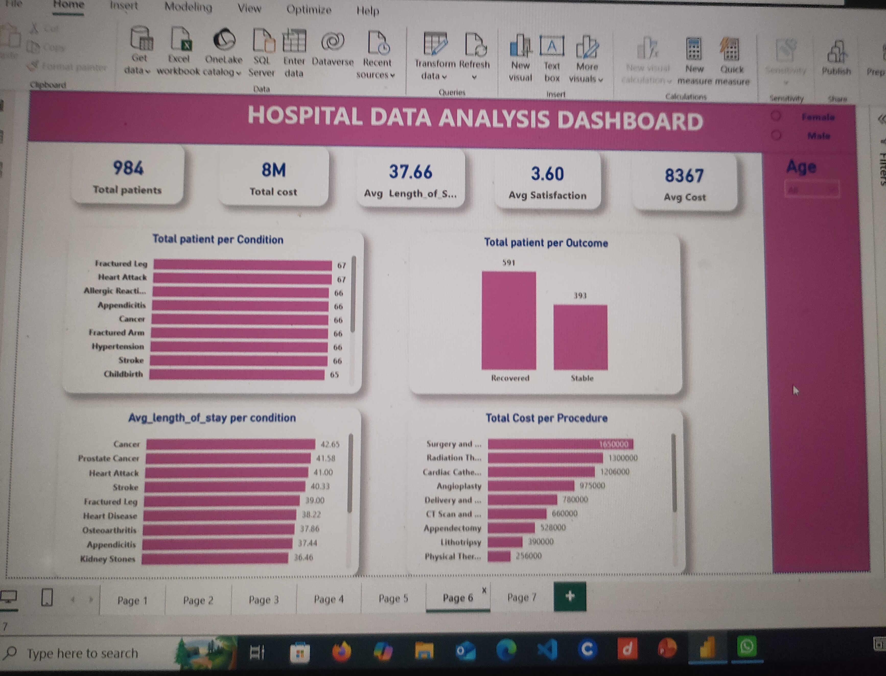

# hospital_operation_dashboard

# Project overview
This project leverages healthcare data to analyze patient outcomes, cost structures, and operational efficiency using Excel, SQL, and Power BI.

# Project objective
The goal of this analysis is to provide actionable insights into patient care, understanding key metrics such as:
  - ​Financial and Patient Metrics.
  - Operational Efficiency.
  - ​Patient Demographics and Case-Mix.
- Treatment and Financial Performance.

# Data Source & Description

The dataset used for this analysis was sourced from **[Kaggle.com](https://www.kaggle.com)**. It contains simulated hospital operational records designed to mimic real-world healthcare administration data, capturing patient demographics, clinical conditions, administrative costs, and treatment outcomes.

## Key Features of the Dataset:
* **Patient Demographics:** Includes unique tracking attributes such as Patient ID, Age, and Gender.
* **Clinical Records:** Tracks specific medical diagnoses (e.g., Heart Attack, Appendicitis, Cancer) and the procedures administered (e.g., Angioplasty, Appendectomy, Radiation Therapy).
* **Operational & Metrics Data:** Records critical metrics like **Length of Stay (LOS)** and **Patient Satisfaction Scores**.
* **Financial Data:** Details the total cost associated with each patient's admission and specific procedures.

 # Tools used
  - Excel
  - Power query
  - SQL
  - Power BI

 # Data Cleaning and preparation Process
  While the source data was cleaned, a systematic preparation process was executed to transform the data into analytial format:
  - Conversion of the raw data into a table.
  - The sumif  function was utilized to calculate the Total cost per medical condition.
  - A pivot Table was constructed from the data to summarize the complex relationship between medical condition amd cost.

# Dashboard Architecture & Visualizations

The Power BI dashboard shown utilizes a clean, container-based layout with a cohesive color theme to segment clinical, financial, and operational metrics. The user interface is structured to guide a stakeholder's eye from high-level summaries down to granular departmental insights.

## A. Key Performance Indicators (KPI Cards)
Positioned horizontally across the top banner for immediate high-level awareness:
* **Total Patients (984):** Displays the total volume of patient admissions captured in the dataset.
* **Total Cost ($8M):** Summarizes the overall financial expenditure/revenue across all operations.
* **Avg Length of Stay (37.66 days):** Tracks operational throughput and bed utilization efficiency.
* **Avg Satisfaction (3.60):** Measures the quality of patient care and experience.
* **Avg Cost ($8,367):** Monitors the mean financial impact per patient admission.

## B. Core Visualizations & Analytical Elements
The main body of the dashboard splits operational volume from financial and clinical outcomes:
* **Total Patient per Condition (Horizontal Bar Chart):** Breaks down the patient census by medical diagnosis (e.g., Fractured Leg, Heart Attack, Appendicitis) to identify primary drivers of hospital admissions.
* **Total Patient per Outcome (Column Chart):** Provides a snapshot of clinical efficacy by comparing total volume between distinct discharge categories (e.g., Recovered vs. Stable).
* **Avg Length of Stay per Condition (Horizontal Bar Chart):** Cross-references operational tracking with clinical conditions to highlight which diagnoses demand the longest recovery times (e.g., Cancer, Prostate Cancer).
* **Total Cost per Procedure (Horizontal Bar Chart):** Pinpoints the most capital-intensive medical interventions (e.g., Surgery, Radiation Therapy) to support financial budgeting.

## C. Interactive Slicers & Filtering
Located on the right-hand side panel to allow dynamic, on-the-fly data discovery:
* **Gender Slicer:** Radio buttons filtering the entire canvas by *Female* or *Male* demographics.
* **Age Slicer:** A dropdown filter allowing administrators to drill down into specific age groups or cohorts.

  
